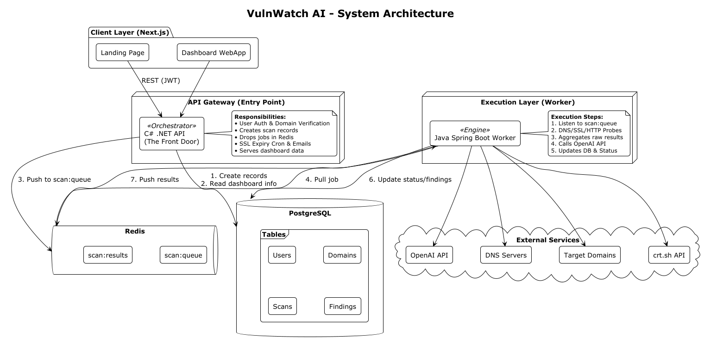
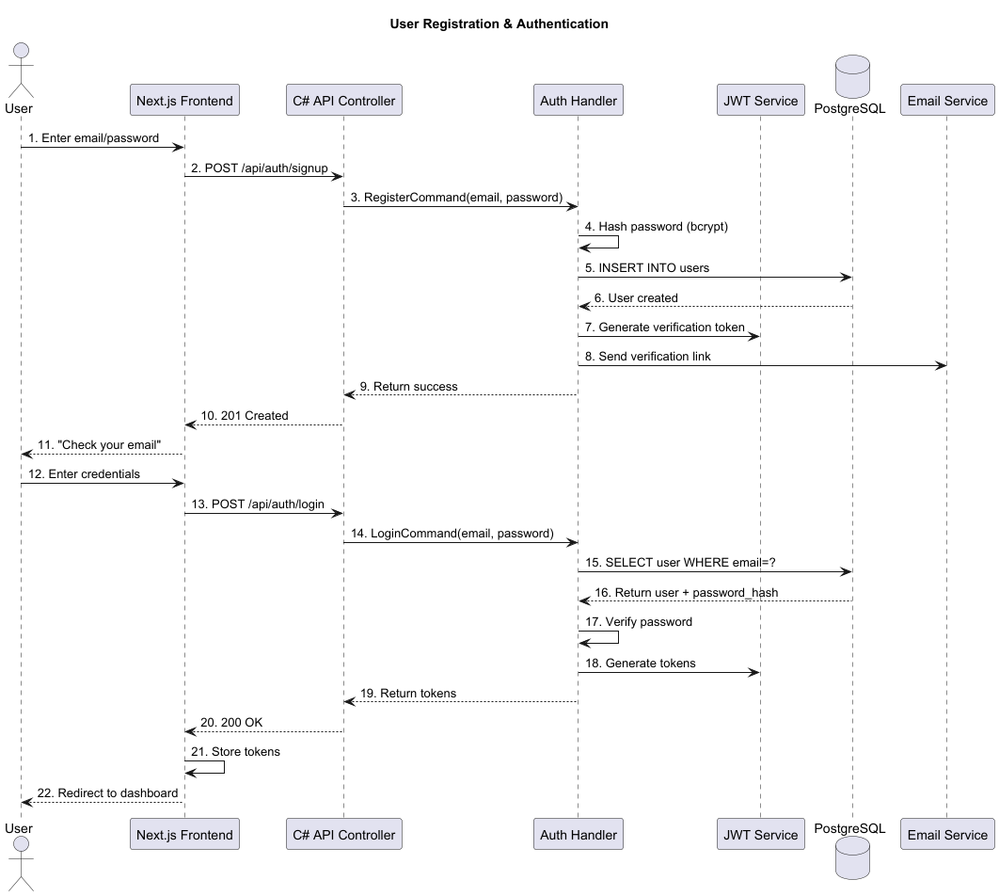
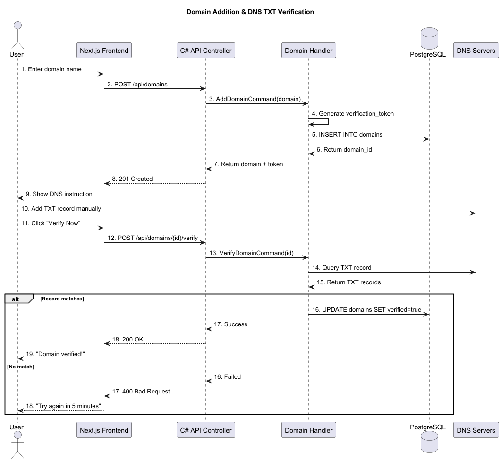
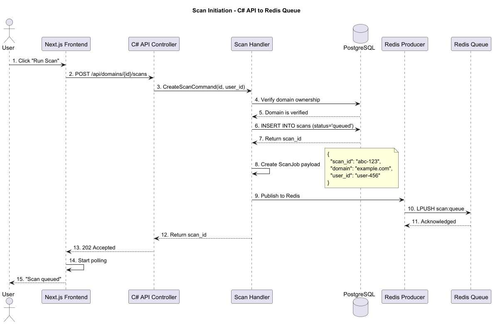
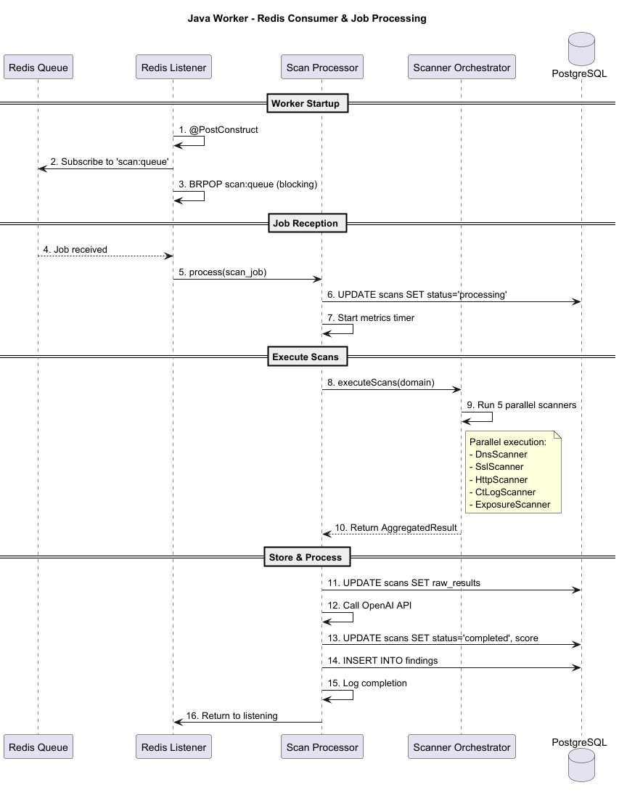
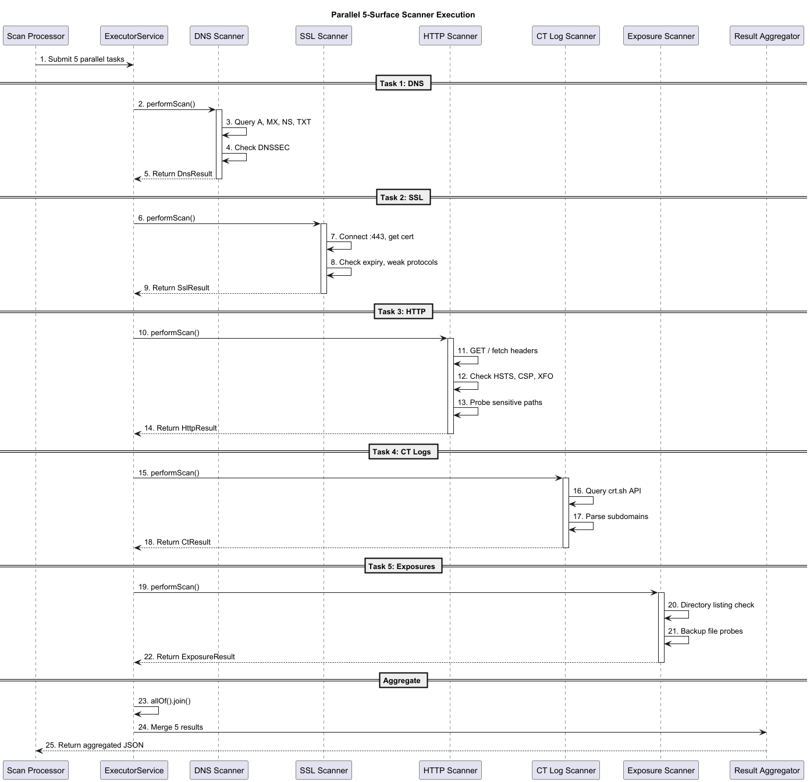
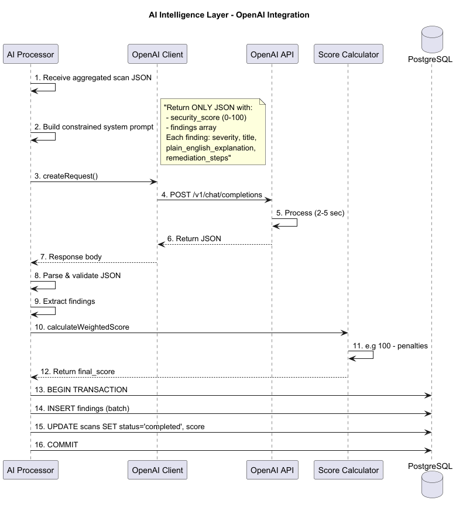
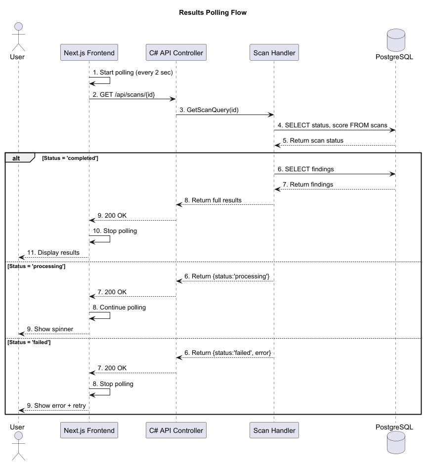
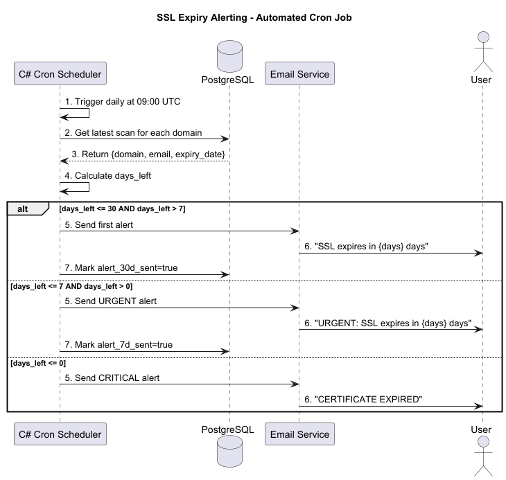
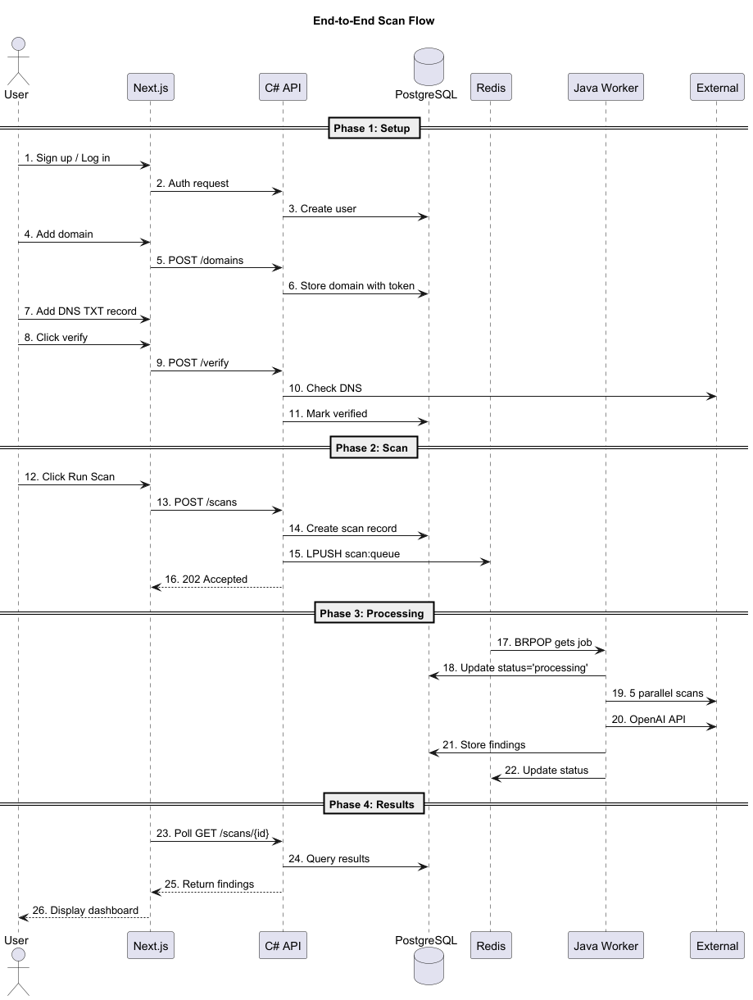

# VulnWatch AI - High-Level Design Document (HLD)

## Document Information


| Property          | Value                   |
| ----------------- | ----------------------- |
| **Project**       | VulnWatch AI            |
| **Document Type** | High-Level Design (HLD) |
| **Version**       | 1.0                     |
| **Date**          |                         |
| **Status**        | Approved                |

---

## Table of Contents

1. [System Overview](#1-system-overview)
2. [Architecture Diagram](#2-architecture-diagram)
3. [Component Breakdown](#3-component-breakdown)
4. [Technology Stack](#4-technology-stack)
5. [Sequence Diagrams](#5-sequence-diagrams)
6. [Appendix](#6-appendix)
7. [Document Sign-off](#7-document-sign-off)

---

## 1. System Overview

### For a high-level summary of the project, see the [Architecture Overview](overview.md).

---

## 2. Architecture Diagram

The following diagram illustrates the high-level orchestration between the .NET API, the Java processing engine, and the shared data layers



## 3. Component Breakdown

### 3.1 C# .NET API (The Front Door)


| Aspect                   | Description                                                  |
| ------------------------ | ------------------------------------------------------------ |
| **Role**                 | Entry point, orchestrator, request router                    |
| **Framework**            | .NET 8 with Clean Architecture                               |
| **Key Responsibilities** | User auth, domain verification, job queueing, result serving |

### 3.2 Java Spring Boot Worker (The Engine)


| Aspect                   | Description                                  |
| ------------------------ | -------------------------------------------- |
| **Role**                 | Security scanning and AI processing          |
| **Framework**            | Spring Boot 3.x                              |
| **Key Responsibilities** | 5-surface scans, OpenAI integration, scoring |

### 3.3 Redis (Message Broker)


| Queue Name     | Producer    | Consumer          | Purpose              |
| -------------- | ----------- | ----------------- | -------------------- |
| `scan:queue`   | C# API      | Java Worker       | Distribute scan jobs |
| `scan:results` | Java Worker | C# API (optional) | Completion status    |

### 3.4 PostgreSQL (Database)


| Table        | Written By  | Read By | Purpose                 |
| ------------ | ----------- | ------- | ----------------------- |
| `users`      | C# API      | C# API  | Authentication          |
| `domains`    | C# API      | Both    | Domain management       |
| `scans`      | Both        | C# API  | Scan metadata + results |
| `findings`   | Java Worker | C# API  | Security findings       |
| `alert_logs` | C# API      | C# API  | Email audit trail       |

---

## 4. Technology Stack


| Layer              | Technology            | Version | Purpose                  |
| ------------------ | --------------------- | ------- | ------------------------ |
| **Frontend**       | Next.js               | 14.x    | Dashboard + Landing Page |
|                    | TypeScript            | 5.x     | Type safety              |
|                    | Tailwind CSS          | 3.x     | Styling                  |
| **Backend (API)**  | C# / .NET             | 8.0     | REST API                 |
|                    | Entity Framework Core | 8.0     | ORM for PostgreSQL       |
|                    | -                     | xxx     | Redis client             |
|                    | -                     | Latest  | Cron jobs                |
| **Worker**         | Java                  | 17 LTS  | JVM runtime              |
|                    | Spring Boot           | 3.5.x   | Framework                |
|                    | Spring Data JPA       | Latest  | Database access          |
|                    |                       |         | Redis client             |
| **Infrastructure** | PostgreSQL            | 15+     | Primary database         |
|                    | Redis                 | 7.x     | Message broker           |
|                    | Docker                | Latest  | Containerization         |
|                    |                       |         |                          |
| **External APIs**  | OpenAI                | -       | AI intelligence          |
|                    |                       | -       |                          |
|                    |                       | -       | Email delivery           |

---

## 5. Sequence Diagrams

### 5.1 User Authentication Flow



### 5.2 Domain Verification Flow



### 5.3 Scan Initiation Flow (C# → Redis)



### 5.4 Java Worker - Redis Consumer & Job Processing



### 5.5 Java Worker - Parallel 5-Surface Scanner



### 5.6 AI Intelligence Layer (OpenAI)



### 5.7 Results Polling Flow (Frontend ← C#)



### 5.8 SSL Expiry Alerting (C# Cron Job)



### 5.9 Complete End-to-End Flow



### 🛠️ How to Update Diagrams

To ensure the documentation stays in sync with the codebase, please follow these steps if you make architectural changes:

1. **Requirement**: Install the **PlantUML Integration** plugin in your IDE (IntelliJ or VS Code).
2. **Edit Source**: Open the source file located at `docs/puml/system_component.puml` (or the specific `.puml` file for the flow you are changing).
3. **Export**:
   * **In IntelliJ**: Use the **Save Diagram** icon in the PlantUML tool window.
   * **In VS Code**: Use `Alt + D` to preview and then export the file.
4. **Overwrite**: Save the updated version as a `.png` (e.g., `system_component.png`) in the `docs/puml/` directory. Ensure the filename matches the existing one exactly to update the link.
5. **Commit**: Include both the `.puml` source and the `.png` export in your Pull Request.

> If you add a **new** diagram, simply follow the steps above and reference it in this file using:
> ``

---

## 6. Appendix

### 6.1 Redis Message Schemas

**Scan Job (C# → Worker)**

```json
{
  "scan_id": "uuid",
  "domain": "string",
  "user_id": "uuid",
  "timestamp": "ISO8601",
  "retry_count": 0
}
```

**Scan Result (Worker → C#)**

```json
{
  "scan_id": "uuid",
  "status": "completed|failed",
  "security_score": 0-100,
  "finding_count": "int",
  "processed_at": "ISO8601"
}
```

### 6.2 API Endpoint Summary


| Method | Endpoint                    | Purpose       |
| ------ | --------------------------- | ------------- |
| POST   | `/api/auth/signup`          | Register      |
| POST   | `/api/auth/login`           | Login         |
| POST   | `/api/auth/google`          | Google OAuth  |
| POST   | `/api/domains`              | Add domain    |
| POST   | `/api/domains/{id}/verify`  | Verify domain |
| POST   | `/api/domains/{id}/scans`   | Trigger scan  |
| GET    | `/api/scans/{id}`           | Get results   |
| GET    | `/api/monitoring/dashboard` | Live status   |

---

## 7. Document Sign-off


| Role              | Name | Date | Signature |
| ----------------- | ---- | ---- | --------- |
| Product Owner     |      |      |           |
| Team Lead (C#)   |      |      |           |
| Team Lead (Java) |      |      |           |
|                   |      |      |           |

---
